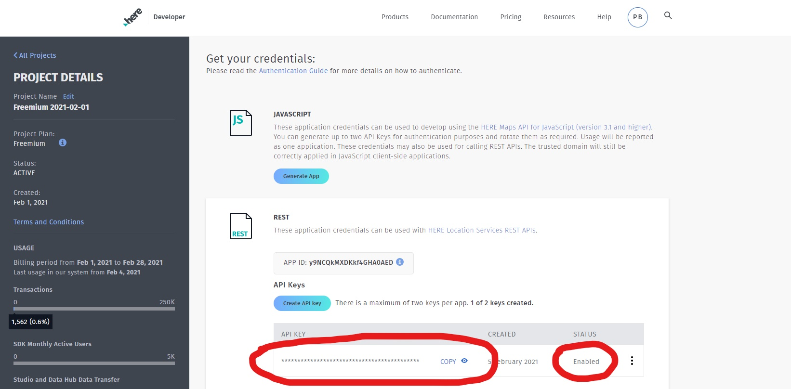

```{r include=FALSE}
knitr::opts_chunk$set(warning = FALSE, message = FALSE)
library(knitr)
purl("Workbook-Part1.Rmd", documentation = 0)
```


## Part 1: Retail Centres

## Welcome

This is part 1 of the 2 part course from CDRC on using the UK Retail Centres dataset to create retail catchments. The video in this part introduces the Retail Centres data set, and the practical session shows you how to work with the Retail Centres dataset in R. If you are completely new to RStudio, please check out our [Short Course on Using R as a GIS](https://data.cdrc.ac.uk/dataset/short-course-using-r-gis).

After completing this material, you will:

* Understand what the CDRC Retail Centres dataset is and what it looks like
* Know how to construct a Hierarchy for the Retail Centres
* Know how to delineate fixed-ring buffers for the Retail Centres
* Know how to derive drive-time catchments for Retail Centres using the HERE API.

The following video will provide an introduction to Retail Centres.

----

<iframe width="560" height="315" src="https://www.youtube.com/embed/cRBi5lsYV58" frameborder="0" allow="accelerometer; autoplay; clipboard-write; encrypted-media; gyroscope; picture-in-picture" allowfullscreen></iframe>

----

## Setup

First we want to set up the libraries that we are going to be using for this practical - most of them should be familiar (e.g. `dplyr`, `sf`, `tmap`). However, the `hereR` library will likely be new - we are going to use this later, so install it for now and we will come back to it later.

```{r }
library(sf)
library(dplyr)
library(tmap)
#install.packages("data.table")
library(data.table)
library(hereR)
```

Make sure you have set your working directory to wherever you have stored the `CDRC-Retail-Catchment-Training` folder we have provided:

```{r}
#setwd("CDRC-Retail-Catchment-Training")
```

## 1. Data (& Preprocessing)

The first dataset we are going to be using is a geopackage containing the updated Retail Centre boundaries for the UK, which is within your data packs for this practical. We have given you a subset for the Liverpool City Region (LCR), containing the top 20 Retail Centres - determined as the 20 major comparison destinations -  within the LCR.

All datasets you need for this practical are contained within the `Data` subfolder within the `CDRC-Retail-Catchment-Training` folder we provided.

```{r}
## Read in the Retail Centre Boundaries 
rc <- st_read("Data/LCR_Retail_Centres_2018.gpkg")
```

Let's take a look at the Retail Centre data:

```{r}
## Print the first ten retail centres
rc
```

So for each Retail Centre (polygon):

* `rcID` - Unique ID for each Retail Centre
* `n.units` - Total number of Retail units in each centre, calculated using the 2018 LDC Secure Retail Unit Data
* `n.comp.units` - Total number of Retail units in each centre, classified as 'comparison' retail.
* `rcName` - Name for each Retail Centre
* `RetailPark` - An indicator that tells us whether the Retail Centre is a major retail park

Let's map the Retail Centre polygons. Throughout this practical we will be using the tmap R package for all exploratory mapping - for more info on tmap visit: https://github.com/mtennekes/tmap.

In the next chunk of code we first setup the plotting mode that we want to use throughout this practical (`tmap_mode`). The default option is `"plot"` which will produce any of your plots over a plain background. By setting `tmap_mode` to `"view"` your layers are plotted automatically over an interactive leaflet basemap. 

Then we plot the Retail Centres by calling the `rc` object in the tm_shape() command, before specifying `tm_fill(`) as the data is polygons not points or lines. Finally, we call `tm_text()` to label each of the polygons, specifying that we want the labels to be drawn from the `rcName` column - containing the names of the Retail Centres.

```{r}
## Setup plotting
tmap_mode("view")

## Map Retail Centre Polygons for LCR
tm_shape(rc) +
  tm_fill(col = "orange") +
  tm_text("rcName", size = 0.75)
```

For the purpose of this analysis we want to extract the centroids of the Retail Centres to work with and construct catchments from. 

*A centroid is the central point of the polygon.* 

It is common practice when constructing catchments to do so with point data, so in this sense centroids are very helpful. The `sf` package has a neat `st_centroid()` function for extracting centroids from polygons.

```{r}
## Extract centroids
rc_cent <- st_centroid(rc)
```

Let's map the Retail Centre Centroids, noting we are using points to show the retail centres, rather than polygons:

```{r}
## Map the centroids - note: tm_dots() is used as the object rc_cent contains point data (Retail Centre centroids)
tm_shape(rc_cent) +
  tm_dots(col = "orange") +
  tm_text("rcName", size = 0.75)
```


## 2. Creating a Retail Hierarchy

In this section we are going to build a three-tier hierarchy of Retail Centres. The hierarchy will be based on two things: the total number of comparison units in the centre (`n.comp.units`), and whether or not the Retail Centre is considered a major retail park.

In this next chunk of code we use the `mutate` function and `case_when` statements to generate a new column called `'hierarchy'` where the Retail Centres are assigned as being 'primary', 'secondary' or 'tertiary' based on the number of comparison units in a centre (`n.comp.units`) and the value for Retail Park. Finally, we sort the dataset by the hierarchy column, using the arrange() function.

The conditions are set as follows:

  * Primary Centres - 100 + comparison retail units
  * Secondary Centres - 50 - 99 comparison retail units **OR** a major retail park
  * Tertiary Centres - Less than 50 comparison retail units

Notice how we are using `&` and `|` in the `case_when` statements, with `&` meaning **AND** and `|` meaning **OR**.  

For example, in the first assignment (tertiary), for a centre to be tertiary it has to have less than 50 comparison units **AND** not be a Retail Park ("N"). In the second example, we assign secondary centres as either those with comparison unit count between 50 and 99 **OR** those that are Retail Parks ("Y"). Notice how I have used the `|` symbol to account for the **OR** condition in the assignment of secondary centres.

```{r}
## Use mutate and case_when to create the new column - notice how ~ assigns the new values based on the condition
rc_cent_nopipes <-  mutate(rc_cent, 
   hierarchy = dplyr::case_when(n.comp.units < 50 & RetailPark == "N" ~ "tertiary",
                              (n.comp.units >= 50 & n.comp.units < 100) | RetailPark == "Y" ~ "secondary",
                                n.comp.units >= 100 ~ "primary")) 
```

We then want to extract only certain columns from the data, which we can achieve using the `select()` function from `dplyr`:

```{r}
## Use select to extract the id, n.units, n.comp.units and hierarchy columns
rc_cent_nopipes <- select(rc_cent_nopipes, rcID, rcName, n.units, n.comp.units, RetailPark, hierarchy)
```

Finally, we want to sort the data by the hierarchy column

```{r}
## Sort by hierarchy
rc_cent_nopipes <- arrange(rc_cent_nopipes, hierarchy)
```

However, there is an alternative to writing two separate chunks of code to create the hierarchy, extract the columns we want and then sort the data by hierarchy. You may have seen pipes before - `%>%` - as they are commonly used to integrate various `dplyr` functions together. They work by taking the output from one function (e.g. the creation of the hierarchy column with `mutate`) and feed it into the first argument of the next function (e.g. selection of columns with `select`). We'll show you how you can do it below:

```{r}
## Use pipes to create the new hierarchy column and then select the other columns we are interested in
rc_cent <- rc_cent %>% 
  mutate(hierarchy = dplyr::case_when(n.comp.units < 50 & RetailPark == "N" ~ "tertiary",
             (n.comp.units >= 50 & n.comp.units < 100) | RetailPark == "Y" ~ "secondary",
              n.comp.units >= 100 ~ "primary")) %>%
  select(rcID, rcName, n.units, n.comp.units, RetailPark, hierarchy) %>%
  arrange(hierarchy)
```


Notice how when piping you don't need to tell the `mutate()` and `select()` functions what object you want to perform that operation on, as it is piping directly from `rc_cent`. For clarity, let's compare the output with and without pipes:

```{r}
## Without pipes
rc_cent_nopipes
```

```{r}
## With pipes
rc_cent
```

The two outputs are identical. Whether you choose to use pipes is up to you - they can really speed up data transformation, but at the same time make it harder to untangle some broken code. For more information and tutorials on piping and how to use it with different dplyr functions, please visit: https://seananderson.ca/2014/09/13/dplyr-intro/

From the `rc_cent` object you can see that each Retail Centre has now been assigned a hierarchical category (`hierarchy`), which we will use throughout the rest of the practical in determining catchments for the centres, that differ based on the hierarchical position of the centres. 

You can also use the `View()` command to view the `rc_cent` data in a new tab if you want to:

```{r}
## View rc_cent
View(rc_cent)
```

## 3. Catchments (1) - Fixed-Ring Buffers

Fixed-Ring Buffers are the simplest catchments, and involve drawing a circular buffer around a store (or retail centre) based on a fixed value of distance, which accounts for the expected distances consumers are willing to travel. Fixed-Ring buffers can be easily delineated in R using the `st_buffer()` function, where you give the function a simple features point object and distance (dependent on projection), and it returns a buffer for each individual point. 

*Our data (`rc_cent`) uses the British National Grid coordinate system, so any buffer distance will be in metres.*

```{r}
## Extract a 1500m buffer for each Retail Centre
buffer1.5km <- st_buffer(rc_cent, 1500)
```

Let's map these to see what they look like. *Note: I am setting alpha to 0.3 so I can see overlapping buffers clearly.*

```{r }
## Map the buffers
tm_shape(buffer1.5km) + ## Plot the buffers
  tm_fill(col = "orange", alpha = 0.3) +
  tm_shape(rc_cent) + ## Overlay the centroids
  tm_dots(col = "orange") +
  tm_text("rcName", size = 0.75)
```

However, it is more informative to have buffers that vary in size depending on the hierarchical position of the Retail Centres. In this next chunk of code we have created a small function to do this. Functions are really helpful tools that enable you to apply a series of methods in sequence and return the output. This is particularly helpful when you need to repeat steps over and over again, as it removes the need for typing out the same lines of code multiple times. For those new to functions, watch this [short video](https://youtu.be/N3u1rThaYGg).

The function we have created delineates a 5000m catchment for Retail Centres classed as primary. It has three steps:

* Filters the centroids to get only 'primary' centres
* Constructs a 5000m buffer for the 'primary' centres
* Returns the 5000m buffer for the primary centres

To use the function you need to run this next chunk of code to save the function to your environment, and then you can apply the function in a subsequent line of code to your dataset, to extract the catchments. 


```{r}
## Run this chunk to save the function to your environment
get_primary_buffer <- function(centroids) {
  
  ## Extracts centroids of 'primary' Retail Centres
  rc_primary <- filter(centroids, hierarchy == "primary")
  
  ## Constructs a 5000m buffer
  primary_buffer <- st_buffer(rc_primary, dist = 5000)
  
  ## Return the 5000m buffer
  return(primary_buffer)
}
```

So now that we have the `get_primary_buffer` function saved under 'Functions' in my environment pane, we can run it on the dataset to extract primary catchments.

```{r}
## Get primary buffers for LCR Retail Centres
pbuffer <- get_primary_buffer(rc_cent)
```

Let's plot these:

```{r}
## Plot the primary buffers and all the centroids, to check only primary centres have catchments
tm_shape(pbuffer) +
  tm_fill(col = "orange", alpha = 0.3) +
  tm_shape(rc_cent) +
  tm_dots(col = "orange") +
  tm_text("rcName", size = 0.75)
```


Notice how we have buffers for only the Liverpool City and Southport Retail Centres - as these are the only primary centres in this dataset.

However, if we wanted to build buffers that vary in size depending on the three different hierarchy categories, we would need to build a more complex function. The function below (`get_buffer`) does the same as the `get_primary_buffer` function,  but builds catchments for primary, secondary and tertiary centres that differ in size. We have also included some additional arguments (`primary_dist`, `secondary_dist`, `tertiary_dist`) that enable you to modify the size of the buffer for each type of centre.

*Note: An additional step is included in the `get_buffer` function - `rbind()` is used to row bind the primary, secondary and tertiary buffers together into one object that is returned.*

So, run the next chunk to save the `get_buffer` function to your environment:

```{r}
## Run this chunk to save the function to your environment
get_buffer <- function(centroids, primary_dist = 5000, secondary_dist = 3000, tertiary_dist = 1500) {
  
  ## Split up the Retail Centres based on hierarchy
  rc_primary <- filter(centroids, hierarchy == "primary")
  rc_secondary <- filter(centroids, hierarchy == "secondary")
  rc_tertiary <- filter(centroids, hierarchy == "tertiary")
  
  ## Run the buffer for the different Retail Centre hierarchies separately
  primary_buffer <- st_buffer(rc_primary, dist = primary_dist)
  secondary_buffer <- st_buffer(rc_secondary, dist = secondary_dist)
  tertiary_buffer <- st_buffer(rc_tertiary, dist = tertiary_dist)
  
  ## Join together
  buffer <- rbind(primary_buffer, secondary_buffer, tertiary_buffer)
  return(buffer) ## Return
}
```

Now run the function using the default buffer distances, these we feel are a good representation of the distances most people would be willing to travel to access the different types of centres:

```{r}
## Run the function
hbuffer <- get_buffer(rc_cent, primary_dist = 5000, secondary_dist = 3000, tertiary_dist = 1500)
```

Excellent! Now map these to see what they look like:

```{r }
tm_shape(hbuffer)+ ## Plot the varying fixed-ring buffers
  tm_fill(col = "hierarchy", palette = c("yellow", "orange", "red"), alpha = 0.5) + # Setting col to 'hierarchy' tells tmap to generate a different colour buffer for each value in the hierarchy column
  tm_shape(rc_cent) + ## Overlay the centroids
  tm_dots(col = "orange", alpha = 0.75) +
  tm_text("rcName", size = 0.75)
```

## 4. Catchments (2) - Drive-Time Catchments

In this section we are going to use the HERE API to delineate drive-time catchments for the Retail Centres. You need to make sure you have the 'hereR' package installed, and then need to get an API key to use the functions within the package.

To get an API key:

* Visit: https://developer.here.com/. 
* Click 'Get started for free'. 
* Sign up to create an account with a 'Freemium' subscription as below:


* Click 'Sign Up' 
* Click 'Get coding' 
* Make sure you also confirm your email address, using the email they send you.  


* Underneath REST, click 'Generate App'
* Then click 'Create API Key' 
* Check that the API Key says 'Enabled' under Status, as below:



* Copy the API Key, as above
* Set your API Key within R as below: 

```{r}
## Set API key
#set_key("insert-key-here")
```


```{r include=FALSE}
## Set API key
set_key("vCDN0ru3MdpnoPJxwFDtrnUxPiF5dEX8sH5cyS2KUNY")
```

**NOTE:** This API key will only be valid for a few hours at a time. If you receive this error in this next section: `"Request 'id = 1' failed Status 401."` you will need to go back to the HERE website and generate a new API key - if you already have two in use, just delete these on the site and you will be able to create additional API keys. 

### 4a. Building Simple Drive-Time Catchments

Now you're good to go.

Drive-Time Catchments are similar to Fixed-Ring buffers in that they also apply a fixed measure (e.g. distance, time) from a store or retail centre. However, they are different in that they use digitised road networks, speed limits and transport modes to generate a (more accurate) polygon that represents the extent to which a vehicle can travel in all directions under a certain time limit or distance constraint. 

The function we are going to be using for Drive-Time catchments is the `isoline()` function from the `hereR` package. You supply the function with a series of points, and can then set various parameters such as whether you want the catchment to be based on distance/time (`range_type`) and what transport mode you want the catchment to be based on (`transport_mode`).

Here is an example for the Liverpool City Retail Centre in the dataset, where we set a 15-minute catchment based on car being the transport mode. The `'range'` argument is where you select how you want to determine the maximum size of the catchment; in this case it's by time, and we set a value of 15 - i.e. 15 minutes Drive-Time. 

*NOTE: each value you set for range must be multiplied by 60 for the delineation to work correctly (e.g. range = (15 * 60)).* 

We also set transport_mode to "car" for the purposes of the practical, but there are lots of options available in the [isoline documentation](https://munterfinger.github.io/hereR/reference/isoline.html).*

```{r, warning=FALSE, error=TRUE}
## Extract Liverpool City Retail Centre - the first in our dataset
rc_a <- rc_cent[1, ]

## Extract the 10-minute driving catchment
iso_a <- isoline(rc_a, range = (15 * 60), range_type = "time", transport_mode = "car")
```

Let's map the isoline and its centroid to see what it looks like:

```{r error=TRUE, message=FALSE, warning=FALSE}
## Map the drive-time catchment for the first Retail Centre
tm_shape(iso_a) +
  tm_fill(col = "orange", alpha = 0.5) +
  tm_shape(rc_a) +
  tm_dots(col = "orange") +
  tm_text("rcName", size = 0.75)
```

To extract isolines for more than one point we need to add an additional argument to the isoline function (`aggregate = FALSE`), which prevents the API from combining each individual isoline into one multipolygon. In this case we are going to construct a 5-minute drive-time catchment for each centre:

```{r}
## Extract the 5-minute catchment for every Retail Centre in LCR
iso <- isoline(rc_cent, range = (5 * 60), range_type = "time", transport_mode = "car", aggregate = FALSE)
```

Map them:

```{r,  warning=FALSE, error=TRUE}
## Map the 5-minute drive-time catchments for LCR Retail Centres
tm_shape(iso) +
  tm_fill(col = "orange", alpha = 0.3) +
  tm_shape(rc_cent) +
  tm_dots(col = "orange") +
  tm_text("rcName", size = 0.75)
```

### 4b. Drive-Time Catchments at Different Times/Days

An interesting element with building drive-time catchments is to what extent variations in date/time and traffic are taken into account when building the catchment. For example, a 10-minute drive-time catchment delineated for a Sunday morning is likely to be much larger than for a Friday evening during rush-hour traffic. To demonstrate this, we are going to implement two drive-time catchments for two different days/times of the week. 

To set this up, we need to use the datetime function in the `isoline()` function, we will do it again with the first Retail Centre in the dataset. First for a Friday in rush hour:

```{r}
## First set up the date & time you are interested in - e.g. Friday 7th May - 5pm 
friday7th <- as.POSIXct("2021-05-07 17:30:00 BST", tz = "Europe/London")
## Build the catchment for Friday (rush hour)
friday_iso <- isoline(rc_a, range = (10 * 60), range_type = "time", transport_mode = "car",
                      datetime = friday7th)
```

Then for Sunday morning:

```{r}
## First set up the date & time you are interested in - e.g. Sunday 9th - 5am
sunday9th <- as.POSIXct("2021-05-09 05:00:00 BST", tz = "Europe/London")
## Build the catchment for Friday (rush hour)
sunday_iso <- isoline(rc_a, range = (10 * 60), range_type = "time", transport_mode = "car",
                      datetime = sunday9th)
```

Let's map them - we can build two maps individually saving them as `p1` and `p2`.

```{r}
## Make the Maps
p1 <- tm_shape(friday_iso) +
  tm_fill(col = "orange", alpha = 0.75) +
  tm_shape(rc_a) +
  tm_dots(col = "orange") +
  tm_text("rcName", size = 0.75)
p2 <- tm_shape(sunday_iso) +
  tm_fill(col = "orange", alpha = 0.75) +
  tm_shape(rc_a) +
  tm_dots(col = "orange") +
  tm_text("rcName", size = 0.75)

```

Now that we have the two maps saved as objects, we can plot them side-by-side, using the `tmap_arrange()` function. The function (from the `tma`p package) allows small maps to be arranged in a grid layout. Below we specify that we want them to be side-by-side (`ncol = 2`), but we could stack them on top of each other by swapping `ncol = 2` to `nrow = 2`. 

So you can see a slightly larger catchment for 6am on a Sunday morning in comparison to rush hour on a Friday evening. It is sometimes useful therefore to specify the time/day you want in the hereR API. *If you don't see any difference, try updating the time to the current week.*

```{r, error=TRUE}
## Plot them side-by-side
tmap_arrange(p1, p2, ncol = 2)
```

  
  


### 4c. Building Drive-Time Catchments that account for Retail Centre Hierarchy

The final approach we want to take is to use the hierarchies created in Section 2 to build drive-time catchments that vary depending on the position of the Retail Centre in the hierarchy. Similar to Section 3, I am going to use functions again to make drive-time catchments for the Retail Centres, which vary in size depending on the hierarchy of the Retail Centre.

As in Section 3 we will first show you how you can build a simplified function to extract drive-time catchments for the **primary centres only**. 

The function below does four things:

* Filters the centroids to get only 'primary' centres
* Constructs a 15-minute drive-time catchment for the 'primary' centres
* Merges on the Retail Centre data to the drive-time catchment
* Returns 15-minute drive-time catchments for the primary centres

**Note: We have included three additional arguments. `range_type` and `transport_mode` allow you to select the measure (e.g `time`, `distance`) and mode of transport (e.g. `car`, `bike`, `bus`) for the catchment, and `dist` controls the maximum size of the catchment based on the `range_type` you selected.**

So run the next chunk of code to save the `get_primary_drive_time()` function to your environment:

```{r}
## Function to get drive-time catchments for the primary Retail Centres
get_primary_drive_time <- function(centroids, dist = 15, range_type = "time", transport_mode = "car") {
  
  ## Filter the centroids to extract the primary centres
  rc_primary <- filter(centroids, hierarchy == "primary")
  
  ## Build the drive-time catchment
  primary_drive_time <- isoline(rc_primary, range = (dist * 60), 
                                range_type = range_type, transport_mode = transport_mode, aggregate = FALSE)
  
  ## Clean up the isoline - join on the Retail Centre information
  rc_primary <- rc_primary %>%
    as.data.frame() %>% 
    select(rcID, n.units, n.comp.units, hierarchy) %>%
    bind_cols(primary_drive_time) %>% ## Equivalent of cbind(), but for piping
    st_as_sf() ## Ensures final object is SF not dataframe
  return(rc_primary)
}
```

Now that we have the `get_primary_drive_time` function saved, we can run it on our data to build catchments for only the primary centres, *note: We have set `dist` to 15 which means the function will return a 15-minute drive-time catchment*.

```{r, error=TRUE}
## Get catchments for primary centres
primary_iso <- get_primary_drive_time(rc_cent, dist = 15, range_type = "time", transport_mode =  "car")
```

Now let's map them, and overlay the centroids to check only the primary centres have catchments.

```{r error=TRUE}
## Map the primary drive-time catchments
tm_shape(primary_iso) +
  tm_fill(col = "orange", alpha = 0.5) +
  tm_shape(rc_cent) +
  tm_dots(col = "orange") +
  tm_text("rcName", size = 0.75)
```

So you can see that not all the centres have catchments, as our function is constructed to only delineate catchments for centres that are 'primary'. The next function fixes this, by repeating the steps in the previous function to extract secondary and tertiary catchments as well as the primary ones, before joining these together to extract catchments for every centre in the dataset, using `rbind()` again. 

*Note: We have also included a `primary_dist`, `secondary_dist` and `tertiary_dist` argument so that the sizes of the catchments for each of the three types of centre can be modified. However, these default values we believe provide an accurate representation of the driving distances for each catchment.*

```{r}
## Run this chunk to save this function to your environment
get_drive_time <- function(centroids, primary_dist = 15, secondary_dist = 10, tertiary_dist = 5, 
                           range_type = "time", transport_mode = "car") {
  
  ## Split up the Retail Centres based on hierarchy
  rc_primary <- filter(centroids, hierarchy == "primary")
  rc_secondary <- filter(centroids, hierarchy == "secondary")
  rc_tertiary <- filter(centroids, hierarchy == "tertiary")
  
  ## Delineate the isolines for the different Retail Centre hierarchies separately
  primary_drive_time <- isoline(rc_primary, range = (primary_dist * 60),
                                range_type = range_type, transport_mode = transport_mode, aggregate = FALSE)
  secondary_drive_time <- isoline(rc_secondary, range = (secondary_dist * 60),
                                  range_type = range_type, transport_mode = transport_mode, aggregate = FALSE)
  tertiary_drive_time <- isoline(rc_tertiary, range = (tertiary_dist * 60),
                                 range_type = range_type, transport_mode = transport_mode, aggregate = FALSE)
  
  ## Join the Retail Centre info onto each set of catchments
  primary <- rc_primary %>%
    as.data.frame() %>%
    select(rcID, rcName, n.units, n.comp.units, hierarchy) %>%
    bind_cols(primary_drive_time)
  secondary <- rc_secondary %>%
    as.data.frame() %>%
    select(rcID, rcName, n.units, n.comp.units, hierarchy) %>%
    bind_cols(secondary_drive_time)
  tertiary <- rc_tertiary %>%
    as.data.frame() %>%
    select(rcID, rcName, n.units, n.comp.units, hierarchy) %>%
    bind_cols(tertiary_drive_time)
  
  ## Join catchments together
  isolines <- st_as_sf(rbind(primary, secondary, tertiary))
  return(isolines)
}
```

Now you can run the function. We want to extract a set of drive time catchments using different values for each level of the hierarchy - 15 minutes for primary centres, 10 minutes for secondary centres and 5 minutes for the tertiary centres. 

```{r error=TRUE}
## Extract the hierarchical drive time catchments for LCR Retail Centres
iso_hierarchy <- get_drive_time(rc_cent, primary_dist = 15, secondary_dist = 10, tertiary_dist = 5, 
                                range_type = "time", transport_mode = "car")
```

*If you start getting error messages like this: **In (function (res)  : Request 'id = 7' failed: Status 429.** it means you have made too many requests to the HERE API. Wait for a few seconds, and try again. (See https://developer.here.com/documentation/places/dev_guide/topics/http-status-codes.html for details).*

Great! Now you have drive-time catchments for the Retail Centres that account for the hierarchy. Let's map them to see what they look like:

```{r error=TRUE}
tm_shape(iso_hierarchy) + ## Plot the hierarchical drive-time catchments 
  tm_fill(col = "hierarchy", palette = c("yellow", "orange", "red"), alpha = 0.5) + ## Setting col = 'hierarchy' tells tmap to plot a different colour for each value of hierarchy
  tm_shape(rc_cent) + ## Overlay the centroids
  tm_dots(col = "orange" ) +
  tm_text("rcName", size = 0.75)
```

### 4d. Optional Exercise - Using Pipes with `tmap`

A neat trick if you wanted to extract the catchment for one Retail Centre of interest (e.g. Liverpool Central), would be to using a filter prior to mapping. Remember that pipes automatically feed in the output from one step as the input to the next step, so you won't need to input anything into the `tm_shape()` argument if you've piped directly from `iso_hierarchy`.

```{r, error=TRUE}
## Filter to catchments of interest
iso_hierarchy %>%
  filter(rcName== "Liverpool City") %>%
  tm_shape() + ## Notice how tm_shape can be left empty as you have piped directly from the iso_hierarchy object
  tm_fill(col = "orange", alpha = 0.5) +
  tm_text("rcName", size = 0.75)
```

## Writing Out Your Files

At this point we need to write out the Retail Centre centroids as they contain the 'Hierarchy' column and we will need this for Part 2 of this course. 


```{r}
## Write out to Data folder
# st_write(rc_cent, "Data/Part2_Retail_Centres.gpkg")
```


## Summary 

That's it! OK so that's Part 1 of this practical completed, by now you should have a good understanding of:

* What the CDRC Retail Centres dataset is and what it looks like
* How to construct a Hierarchy for the Retail Centres - using `dplyr` functions and pipes
* How to delineate fixed-ring buffers for the Retail Centres using `st_buffer`, and build functions to automate this
* Know how to derive drive-time catchments for Retail Centres using the `isoline()` function from the `hereR` package.
  
  
----

This practical was written using R and RStudio by Patrick Ballantyne (P.J.Ballantyne@liverpool.ac.uk), and conceptualised by Dr. Les Dolega (L.Dolega@liverpool.ac.uk).  This version was created on `r format(Sys.time(), '%d %B %Y')`.

The latest version of the workbook is available from https://data.cdrc.ac.uk/dataset/advanced-gis-methods-training-retail-centres-and-catchment-areas and https://github.com/patrickballantyne/CDRC-Retail-Catchment-Training. 

Thanks to Dr. Nick Bearman (nick@geospatialtrainingsolutions.co.uk) for his assistance and advice in putting these materials together.

This work is licensed under the Creative Commons Attribution-ShareAlike 4.0 International License. To view a copy of this license, visit http://creativecommons.org/licenses/by-sa/4.0/deed.en. 

